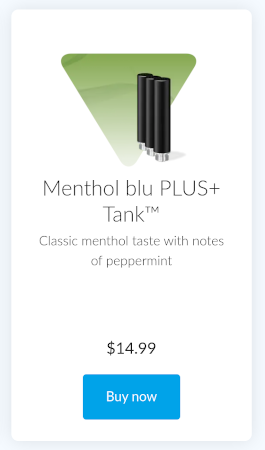

# Frontend Assessment

## 1. Introduction

This assessment is for on-shore, near-shore and off-shore developers that will be part of the development teams working at Fontem Ventures.

The tasks to be completed in this assessment are similar to those you will face in your daily work.

### 1.1. Software prerequisites

We'll assume you have access to the following tools on your development machine:

- `git`
- `node` (see `.nvmrc` for version)
- `yarn`

### 1.2. Completing your assessment

After completing, check the checkmarks at the bottom of this README, then push the last changes to your branch and make a `Pull Request` to the `master` branch. After that, please notify your contact that you've completed the assessment.

This assessment should take you around 4 to 6 hours. You can spend more on it or commit all your work so far and submit changes. We need to estimate your level regardless of how long it took you to complete, so please fill in the **duration** below.

### Very important!

We check knowledge not only in related technologies. Other than the assessment itself, we are also looking at how it’s implemented and check the quality:

- structure;
- naming;
- coupling;
- proper use of technologies;
- formatting;
- testing;
- and others.

You can consider the test assessment as a first code review in our company.

## 2. Tasks

### 2.1. Create a missing product page

Create a new page for products (which currently returns a 404). Then, using `theme-ui` and using the JSON data in `__mocks__/products.json`, attempt to recreate this component and render it for all products:

### 2.2. Create `UserContext`

Create a `UserContext` and fill it with the contents of `__mocks__/user.json`. Then, using a React hook, display the user avatar in the menu top-right circle.

### 2.3. Hide the menu onScroll

Adapt the menu to hide when scrolling down, but show when scrolling back up. Make sure the usability fully checks out.

### 2.4. Add unit test(s)

Write some unit tests for `src/api/getUser.ts`. Add more tests if you have time.

### 2.5. Add typing

Add typing for the `User` data to the API endpoint and the `UserContext`.

### 2.6. Add dynamic user avatar

Refactoring the implementation of 2.2, this task consists of two tasks:

1. Add a NextJS API route that calls `src/api/getUser.ts` and return the response
2. Call the API endpoint on-load and feed the response to `UserContext`, which passes it down

### 2.7. Add cypress tests

Add cypress tests for:

- `Products` page, testing all products are displayed;
- Checks whether the user avatar is displayed;
- Check whether the menu hides.

## Frontend Assessment

Please fill out the table below with (sub)tasks you have completed to review them individually.

#### Completed tasks

Please tick the relevant boxes:

- [X] Products page
- [X] Avatar from context
- [X] Hide menu onScroll
- [X] Unit test
- [X] Dynamic user avatar
- [X] Added `User` typing to the API endpoint and `UserContext`
- [X] Cypress tests

#### Duration

> How long did it take you to finish the above tasks?
4 hours

#### Additional comments

> Enter any comments you might have, describe additional tasks you completed:
